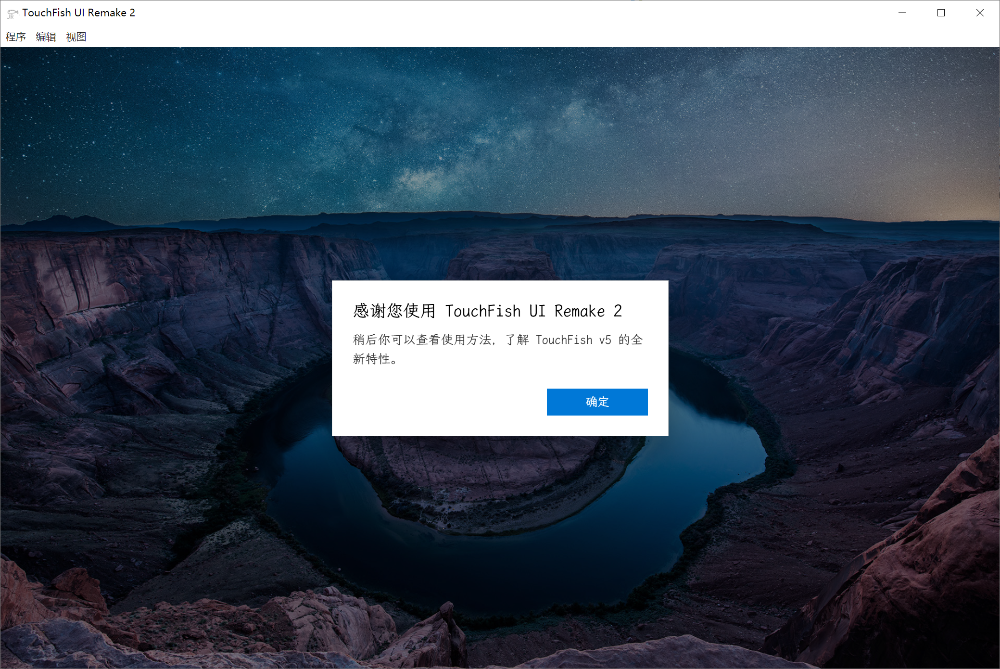
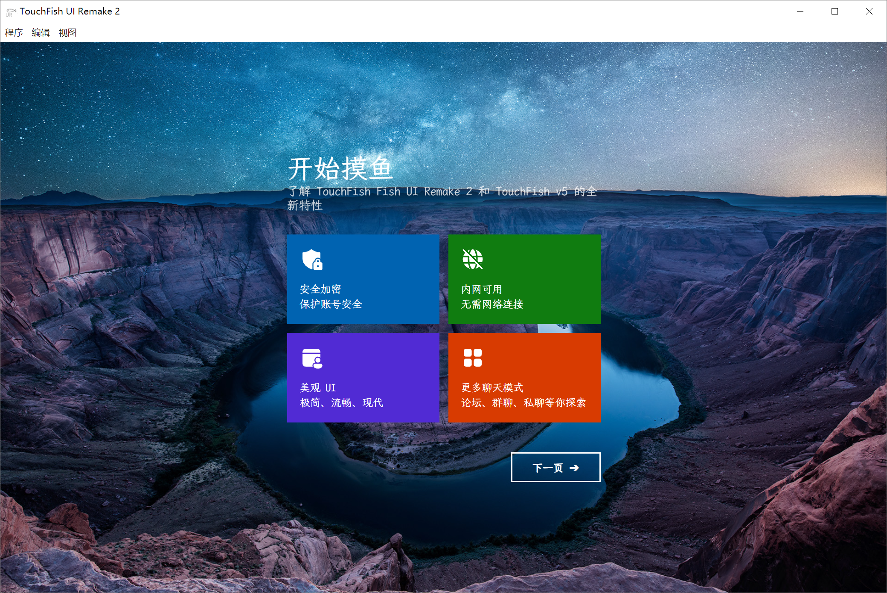
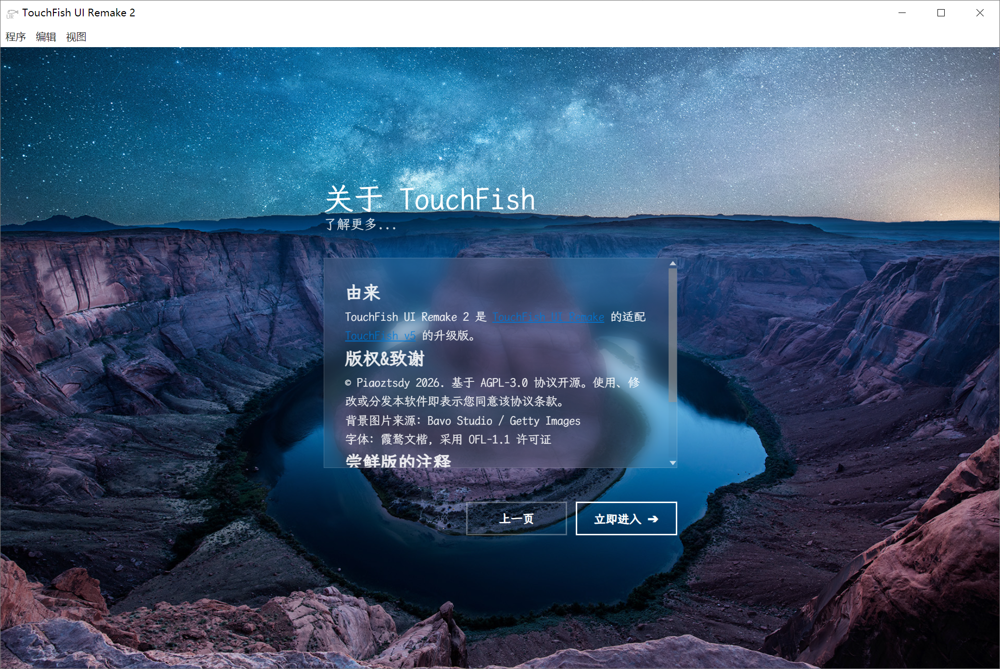
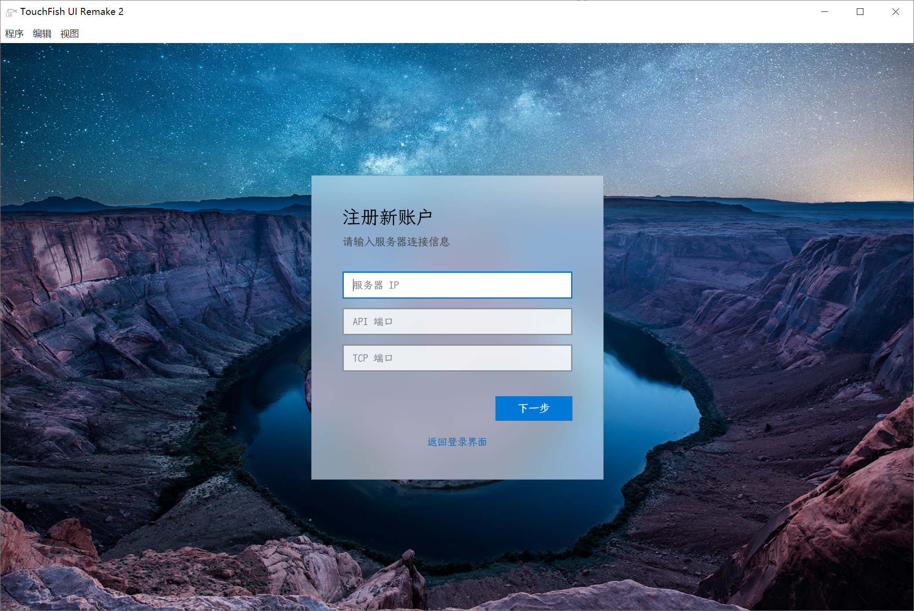
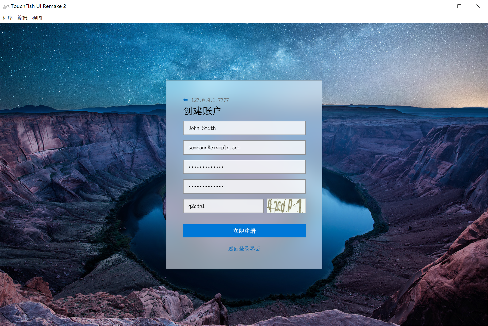
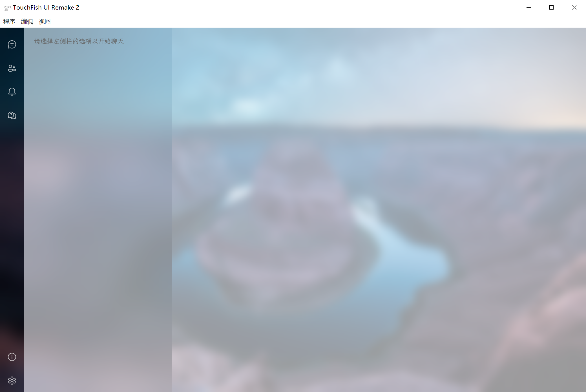

# TouchFish UI Remake 2

> [!WARNING]
> 项目正在施工中。/ The project is under construction.

<div align="center">


<a href="https://github.com/touchfish-devs/TouchFish-UI-Remake-2/blob/main/LICENSE"></a>

<a href="https://github.com/touchfish-devs/TouchFish-UI-Remake-2/releases"></a>

<a href="https://github.com/touchfish-devs/TouchFish-UI-Remake-2/releases"></a>

</div>

---

## 截图 / Screenshots

<table>
  <tr>
    <td></td>
    <td></td>
    <td></td>
  </tr>
  <tr>
    <td></td>
    <td></td>
    <td></td>
  </tr>
</table>

*暂无国际化支持 / No international support available yet.

**情况/功能暂未确定，可能随时变化 / The status/function is not yet determined and may change at any time.

## 安装 / Installation

### Windows

下载 NSIS 安装包（`*.exe`），双击安装。  
Download the NSIS installer (`*.exe`), double-click to install.

（可能需要管理员权限，如果在安装界面中选择“仅为此用户安装”则无需。）  
(Administrator privileges may be required. If you select "Install for this user only" in the installation interface, it is not necessary.)

### macOS

下载 DMG 镜像或 ZIP 包，双击打开。  
Download the DMG image or ZIP bundle, then double-click to open.

（可能需要在「系统设置 → 隐私与安全性」中允许运行。）  
(You may need to allow the app to run in "System Settings → Privacy & Security".)

### Linux

#### AppImage 包 / AppImage Package

下载 AppImage 包，赋予执行权限后运行。  
Download the AppImage package, then run with execute permissions.

```bash
chmod +x <name>.AppImage
./<name>.AppImage
```

（可能需要安装额外的依赖项。）  
(Additional dependencies may be required.)

#### deb 包 / deb Package

仅限 Debian 及其衍生发行版。  
Limited to Debian and its derivative distributions.

使用 `dpkg` 安装 deb 包。  
Use `dpkg` to install the deb package.

```bash
sudo dpkg -i <name>.deb
```

## Star History / Star 历史

<a href="https://www.star-history.com/?repos=touchfish-devs%2FTouchFish-UI-Remake-2&type=date&legend=top-left">
 <picture>
   <source media="(prefers-color-scheme: dark)" srcset="https://api.star-history.com/chart?repos=touchfish-devs/TouchFish-UI-Remake-2&type=date&theme=dark&legend=bottom-right&sealed_token=nZhvqI5XnFVYEeW9lb8F0VioVZ3obffUnybtYBL4k3X9u0gl5sbRYBMXvUtcLWFRIKRcc-XEpGv3r_678Yd5pZ6mdP3fAizg7pFY35MzkFfll4Q_oTRHzg" />
   <source media="(prefers-color-scheme: light)" srcset="https://api.star-history.com/chart?repos=touchfish-devs/TouchFish-UI-Remake-2&type=date&legend=bottom-right&sealed_token=nZhvqI5XnFVYEeW9lb8F0VioVZ3obffUnybtYBL4k3X9u0gl5sbRYBMXvUtcLWFRIKRcc-XEpGv3r_678Yd5pZ6mdP3fAizg7pFY35MzkFfll4Q_oTRHzg" />
   
 </picture>
</a>

## 友链 / Friendly Links

- [TouchFish v5 (Server, temporary?)](https://github.com/2044-space-elevator/TouchFishServer)
- [TouchFish v5 (Client)](https://github.com/ILoveScratch2/TouchFish-Client)
- TouchFish UI Remake 2 (for TouchFish v5) (This page)
- [TouchFish UI Remake (for TouchFish v4)](https://github.com/pztsdy/touchfish_ui_remake)
- [TouchFish v4 (Server & Client)](https://github.com/2044-space-elevator/TouchFishV4)
- TouchFish v3 and earlier versions
  - [TouchFish v3 (Server & Client)](https://github.com/2044-space-elevator/TouchFishV4/tree/v3)
  - [TouchFish v2.0.0 (Server & Client, Release)](https://github.com/2044-space-elevator/TouchFishV4/releases/tag/v2.0.0)
  - [TouchFish v1.3.0 (Server & Client, Release)](https://github.com/2044-space-elevator/TouchFishV4/releases/tag/v1.3.0)

---

Translated by Github Copilot and Google
